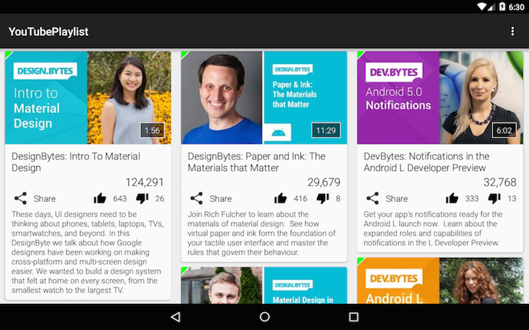
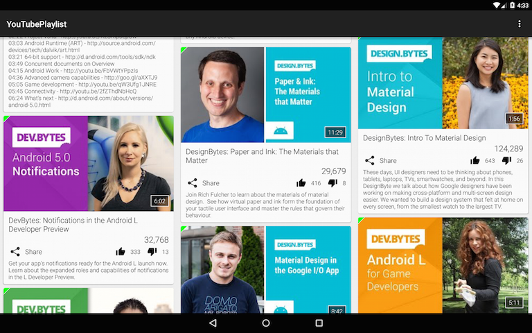

YouTubePlaylist
===============

A sample Android application which demonstrates the use of the [YouTube Data API v3](https://developers.google.com/youtube/v3/).

This sample app makes use of [YouTube Data API v3](https://developers.google.com/resources/api-libraries/documentation/youtube/v3/java/latest/) to fetch a YouTube [Playlist](https://developers.google.com/resources/api-libraries/documentation/youtube/v3/java/latest/com/google/api/services/youtube/model/Playlist.html) and extract the list of [Video](https://developers.google.com/resources/api-libraries/documentation/youtube/v3/java/latest/com/google/api/services/youtube/model/Video.html)'s it contains.  It then renders the list of video's using a [RecyclerView](https://developer.android.com/reference/android/support/v7/widget/RecyclerView.html) of [CardView](https://developer.android.com/reference/android/support/v7/widget/CardView.html)'s in the [YouTubeRecyclerViewFragment](app/src/main/java/com/akoscz/youtube/YouTubeRecyclerViewFragment.java).  The data binding of video details to CardView is handled by the [PlaylistCardAdapter](app/src/main/java/com/akoscz/youtube/PlaylistCardAdapter.java).

[Picasso](https://github.com/square/picasso) is used for downloading and caching the video thumbnail images.
And lastly [Gson](https://code.google.com/p/google-gson) is used to serialize the [Playlist](app/src/main/java/com/akoscz/youtube/model/Playlist.java) datamodel for persistance across orientation changes.

## Setup
  
  * Register your application with the [Google Developer Console](https://developers.google.com/youtube/registering_an_application).  You MUST register your application as a [Web Application](https://developers.google.com/youtube/registering_an_application#web-applications).
  * Create a ["Browser Key"](https://developers.google.com/youtube/registering_an_application#Create_API_Keys) NOT an Android key! 
  * Edit [ApiKey.java](app/src/main/java/com/akoscz/youtube/ApiKey.java) and update `YOUTUBE_API_KEY` with your applications "Browser Key"
  * Edit [YouTubeActivity.java](app/src/main/java/com/akoscz/youtube/YouTubeActivity.java) and update `YOUTUBE_PLAYLIST` to point to your YouTube [playlist](https://www.youtube.com/playlist?list=PLWz5rJ2EKKc_XOgcRukSoKKjewFJZrKV0).

*NOTE:* You MUST have a valid API key for this sample application to work. When you register your application with the Google Developer Console you need to enable the YouTube Data API.  Remember that you need to register a Web Application NOT an Android application because the API key that this sample app uses is the "Browser Key"!
  
## Dependencies

  * [com.android.support:cardview-v7:21.0.3](https://developer.android.com/tools/support-library/features.html#v7-cardview)
  * [com.android.support:recyclerview-v7:21.0.3](https://developer.android.com/tools/support-library/features.html#v7-recyclerview)
  * [com.android.support:support-v4:21.0.3](https://developer.android.com/tools/support-library/features.html#v4)
  * [com.android.support:appcompat-v7:21.0.3](https://developer.android.com/tools/support-library/features.html#v7-appcompat)
  * [com.squareup.picasso:picasso:2.5.2](https://github.com/square/picasso)
  * [com.google.code.gson:gson:2.3.1](https://code.google.com/p/google-gson)
  * com.google.apis:google-api-services-youtube:v3-rev149-1.20.0
  * com.google.http-client:google-http-client-android:1.20.0
  * com.google.api-client:google-api-client-android:1.20.0
  * com.google.api-client:google-api-client-gson:1.20.0

## Screenshots
__Phone__: Single Column Portrait and Landscape

__Tablet__: 7" and 9" (sw600) 2 Columns Portrait, 3 Columns Landscape

__Tablet__: 10" (sw800) 3 Columns Portrait and Landscape

## License

  * [Apache 2.0](http://www.apache.org/licenses/LICENSE-2.0.html)
  
